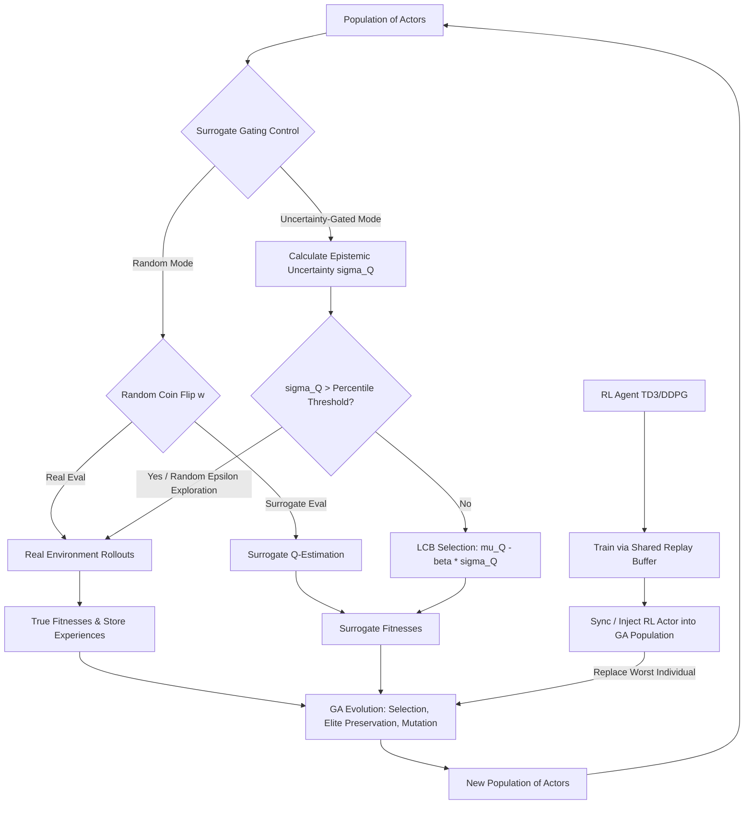

# SC-ERL: Developer & Model Reference Guide

Welcome to the **SC-ERL (Uncertainty-Gated Surrogate-Assisted Evolutionary Reinforcement Learning)** repository. This document serves as a comprehensive developer and AI agent guide to the codebase, explaining its architectural abstractions, mathematical formulations, numerical stability mechanisms, execution pipelines, and workflow best practices.

---

## 🗺️ Architectural Structure & Repository Map

This repository implements a modular framework designed for deep reinforcement learning (RL), evolutionary algorithms (EA), and uncertainty-guided surrogate optimization on complex continuous control tasks (MuJoCo & Fetch Robotics).

```
magisterka_evo_rl/
├── entry_point.py                     # Main Hydra experiment launcher & device selection
├── pyproject.toml                     # Python 3.12 dependencies and uv environment configuration
├── Taskfile.yml                       # CLI Automation task orchestrator (run, tune, report)
├── configs/                           # Hydra Configuration Tree
│   ├── config.yaml                    # Global training, device, logging, and seed defaults
│   ├── tune.yaml                      # Optuna hyperparameter tuning bounds and SQLite path
│   └── algorithm/                     # Algorithm-specific default parameter structures
│       ├── ddpg.yaml, ppo.yaml, td3.yaml, erl.yaml
│       └── sc_erl.yaml                # Detailed surrogate parameters (beta, dropout_p, omega)
├── src/                               # Core Source Code
│   ├── algorithms/                    # RL & Evolutionary Reinforcement Learning implementations
│   │   ├── DDPG/, PPO/, TD3/          # Classical continuous control baselines
│   │   ├── ERL/                       # Canonical ERL (DDPG + GA with shared replay buffer)
│   │   └── SC_ERL/                    # Novel Uncertainty-Gated Surrogate-Assisted ERL
│   ├── common/                        # Shared utility layers and orchestrators
│   │   ├── surrogate_controller.py    # Epistemic uncertainty gating logic & normalization
│   │   ├── evolution_module.py        # Elite preservation, selection, and flat parameter mutation
│   │   ├── utils.py                   # Loss functions, soft-updates, and network parameter flattening
│   │   ├── reply_buffer.py            # Experience replay memory structures (Transition & Buffer)
│   │   ├── fetch_wrappers.py          # Custom wrappers for Fetch environment goal & reward alignment
│   │   └── wandb_logger.py            # Telemetry tracking & WandB interface
│   ├── modules/                       # Custom PyTorch Neural Network architectures
│   │   ├── deep_modules.py            # Actor, Critic, StochasticActor, and Evidential architectures
│   │   ├── ensemble_module.py         # Multi-critic ensemble with prediction standard deviation
│   │   └── mc_dropout.py              # MC Dropout runner for epistemic variance estimation
│   └── optimization/                  # Hyperparameter Optimization (HPO) pipeline
│       ├── optuna_tune.py             # Sequential HPO study loop for Fetch environments
│       └── run_optuna_grid.py         # Multiprocessing-compatible tuning runner across algos/envs
└── plots_and_tests/                   # Post-processing, Analytics & Reporting
    ├── process_results.py             # Raw data compiler and curve generator
    ├── statistical_tests.py           # Welch's t-test, Shapiro-Wilk, and Mann-Whitney U suites
    ├── generate_report.py             # Markdown summary compiling
    └── generate_pdf.py                # FPDF2-powered publication-grade PDF builder
```

---

## 📊 Evolutionary & RL Execution Flow

The hybrid workflow integrates a population of Genetic Algorithm (GA) actors with an off-policy Deep RL agent. The critical novelty in **SC-ERL** is the **Surrogate Gating Control**, which estimates individual policy fitness at near-zero computational cost using the critic network, bypassing slow environment rollouts.



---

## 🧮 Core Mathematical Formulations

SC-ERL leverages uncertainty as a gating mechanism. Candidate policies with low predictive uncertainty are evaluated via the critic surrogate, while those with high uncertainty trigger real rollouts, adding their exact scores and transitioning experiences back into the replay buffer.

### 1. Uncertainty-Gated Surrogate Selection via LCB
When evaluating a candidate policy $\pi_i$, its surrogate fitness $f_{\text{LCB}}(\pi_i)$ is formulated using the **Lower Confidence Bound (LCB)**:

$$f_{\text{LCB}}(\pi_i) = \mu_Q(\pi_i) - \beta \cdot \sigma_Q(\pi_i)$$

Where:
*   $\mu_Q(\pi_i)$ is the normalized average surrogate value across observations.
*   $\sigma_Q(\pi_i)$ is the estimated epistemic uncertainty.
*   $\beta \ge 0$ is the exploration-exploitation parameter (larger $\beta$ penalizes high uncertainty, biasing the system towards real environment validation).

**Gating Decision rule:**
The system computes uncertainty for each individual in the population. If the estimated uncertainty $\sigma_Q(\pi_i)$ is higher than the percentile threshold $\theta_p$ (computed dynamically, e.g., the $75$-th percentile of the population's uncertainties) **OR** if a random exploration coin-flip succeeds (probability $\epsilon = 0.10$), the agent triggers a **real environment evaluation**. Otherwise, the surrogate fitness is accepted.

---

### 2. Epistemic Uncertainty Quantification Methods

#### A. Monte Carlo (MC) Dropout (`surrogate.mode=dropout`)
Approximates the posterior distribution of the network parameters by performing $T$ forward passes with dropout enabled at inference time:

$$\mu_Q(\pi_i) = \frac{1}{T \cdot |D_k|} \sum_{t=1}^T \sum_{s \in D_k} Q^{\text{dropout}}_t(s, \pi_i(s))$$

$$\sigma_Q(\pi_i) = \frac{1}{|D_k|} \sum_{s \in D_k} \sqrt{\frac{1}{T-1} \sum_{t=1}^T \left( Q^{\text{dropout}}_t(s, \pi_i(s)) - \bar{Q}_s \right)^2}$$

Where $D_k$ represents a slice of the replay buffer of size $k$ (the most recent experiences to evaluate local state representation).

#### B. Ensemble of Critics (`surrogate.mode=ensemble`)
Computes the mean and standard deviation across an ensemble of $N$ independently initialized critic heads:

$$\mu_Q(\pi_i) = \frac{1}{N \cdot |D_k|} \sum_{j=1}^N \sum_{s \in D_k} Q_j(s, \pi_i(s))$$

$$\sigma_Q(\pi_i) = \frac{1}{|D_k|} \sum_{s \in D_k} \text{Std}_{j=1\dots N} \left( Q_j(s, \pi_i(s)) \right)$$

#### C. Deep Evidential Regression (`surrogate.mode=evidential`)
Leverages an **Evidential Critic** that parameterizes a conjugate **Normal-Inverse-Gamma (NIG)** distribution. Instead of sampling, a single forward pass yields parameters $(\mu, v, \alpha, \beta)$, where:
*   $\mu$: Expected prediction (Q-value).
*   $v$: Virtual observations (precision parameter).
*   $\alpha$: Shape parameter.
*   $\beta$: Scale parameter.

The epistemic variance (uncertainty) is derived analytically:

$$\sigma^2_{\text{epistemic}} = \frac{\beta}{v(\alpha - 1)}$$

$$\sigma_Q(\pi_i) = \frac{1}{|D_k|} \sum_{s \in D_k} \sqrt{\frac{\beta(s)}{v(s) \cdot (\alpha(s) - 1)}}$$

---

### 3. Sparse Multi-Strength Genetic Mutation
To encourage exploration without catastrophic forgetting, mutation is restricted to a subset of parameters ($10\%$ defined by $p_{mut}$). For a mutated parameter weight $w$, the operator chooses from three noise strengths:

1.  **Normal Mutation** ($90\%$ probability of selected parameters):
    $$w_{\text{new}} = w \cdot (1 + \mathcal{N}(0, \sigma_{mut}^2))$$
2.  **Super Mutation** ($5\%$ probability): Used to jump out of deep local minima.
    $$w_{\text{new}} = w \cdot (1 + \mathcal{N}(0, 100 \cdot \sigma_{mut}^2))$$
3.  **Reset Mutation** ($5\%$ probability): Completely resets parameter value.
    $$w_{\text{new}} = \mathcal{N}(0, 1)$$

After applying mutation, weight clamping is applied:
$$w_{\text{final}} = \text{clamp}(w_{\text{new}}, -10^6, 10^6)$$

---

## 🛡️ Numerical Stability Safeguards

To prevent Q-value divergence, policy degradation, and optimization failures when executing hybrid loops over millions of steps, the codebase integrates four critical architectural protections:

### 1. LayerNorm Protection during Mutation
In the evolutionary module, all instances of `nn.LayerNorm` and `nn.BatchNorm` are fully excluded from flattening and weight mutation. 
> [!IMPORTANT]
> Mutation is restricted strictly to the weights and biases of linear layers (`nn.Linear`). This prevents mutating scale and shift coefficients in normalization layers, which otherwise destroys learned population-level activation statistics.

### 2. Elite Protection during Synchronization
When synchronization occurs (`rl_injection_interval`), the trained RL agent is injected into the evolutionary population. Instead of overwriting a random actor or the elite actor, the injection **overwrites the worst-performing individual** (calculated via `np.argmin` of recent fitnesses). This guarantees that the best-evolved traits are never destroyed by an RL agent that might currently be in an unstable policy updates phase.

### 3. Huber Loss & Critic Weight Decay
Substituting Standard Mean Squared Error (MSE) loss with **Huber Loss (Smooth L1 Loss)** in critic updates ensures robustness against extreme out-of-distribution (OOD) reward signals:

$$\mathcal{L}_{\text{Huber}}(a) = \begin{cases} 0.5 a^2 & \text{for } |a| \le 1 \\ |a| - 0.5 & \text{otherwise} \end{cases}$$

Additionally, applying standard L2 regularization (`weight_decay=1e-4`) in the critic's optimizer halts steady parameter expansion, keeping Q-values bounded and predictable over long trajectories.

### 4. Running Bounds EMA & Tanh Normalization
Before evaluating policies via the LCB rule in Dropout/Ensemble modes, raw Q-values are normalized. The surrogate controller tracks the running minimum and maximum predictions using an Exponential Moving Average (EMA) with a slow-moving factor ($\alpha_{ema} = 0.05$):

$$\text{ema}_{\text{min}} = \alpha_{ema} \cdot \text{batch}_{\text{min}} + (1 - \alpha_{ema}) \cdot \text{ema}_{\text{min}}$$

$$\text{ema}_{\text{max}} = \alpha_{ema} \cdot \text{batch}_{\text{max}} + (1 - \alpha_{ema}) \cdot \text{ema}_{\text{max}}$$

The raw Q-values are mapped to $[-1, 1]$, soft-clipped using a $\tanh$ safety net, and then rescaled. This bounds transient Q-spikes and stabilizes the LCB penalty calculation.

---

## 🛠️ CLI Task Reference (Taskfile)

The repository uses `task` (Taskfile.yml) to manage execution steps:

| Command | Description | Example |
| :--- | :--- | :--- |
| `task run` | Runs a single training experiment with Hydra arguments | `task run ALGO=sc_erl CLI_ARGS="env.id=HalfCheetah-v5 surrogate.mode=dropout"` |
| `task tune` | Performs sequential Optuna tuning on the four Fetch environments | `task tune ALGO=sc_erl CLI_ARGS="surrogate.mode=dropout"` |
| `task tune-all` | Run sequential HPO across all 5 algorithms and 4 environments | `task tune-all CLI_ARGS="n_steps=50000"` |
| `task run-fetch-parallel` | Runs the full Fetch robotics grid (5 seeds, all algos/modes) concurrently | `task run-fetch-parallel` |
| `task report` | Compiles raw WandB metrics, runs statistical tests, and generates reports | `task report` |
| `task clean` | Wipes output directories, cached plots, hydra configurations, and reports | `task clean` |

---

## 💡 Best Practices for LLMs and AI Agents

If you are an AI assistant or a model pair-programming with the user on this repository, observe the following constraints and patterns:

### 1. Exclude LayerNorm from Operations
When performing operations that manipulate parameters directly (e.g. flattening, calculating weight norms, mutating networks), always isolate and exclude normalization modules:
```python
# Correct pattern: Exclude normalization modules
excluded_params = set()
for m in module.modules():
    if isinstance(m, (nn.LayerNorm, nn.BatchNorm1d, nn.BatchNorm2d)):
        for p in m.parameters():
            excluded_params.add(p)
```

### 2. Device Selection Mechanics
Never hardcode `cuda` or `cpu`. Always respect the `cfg.device` configuration. The framework features an auto-detection layer prioritizing:
`CUDA (NVIDIA)` $\rightarrow$ `MPS (Apple Silicon)` $\rightarrow$ `CPU`.
Ensure you pass the device parameter (`self.device` or `device`) correctly down to all PyTorch modules.

### 3. Interfacing with WandB Logger
The logger handles dictionaries of arbitrary floats/metrics seamlessly. Avoid manual formatting of scalar strings for W&B. Instead, pass metrics directly:
```python
if self.logger is not None:
    self.logger.log({
        "train/critic_loss": critic_loss,
        "train/actor_loss": actor_loss,
        "surrogate/uncertainty_mean": self.surrogate_controller.last_uncertainty_mean,
    })
```

### 4. Continuous Control Constraints
Continuous action spaces require tight boundary checks. Always clamp actions resulting from policy evaluations before sending them to `env.step(action)`:
```python
action = np.clip(action, env.action_space.low, env.action_space.high)
```

---

*This guide was generated by the Antigravity assistant team. Update this document as new algorithms, surrogate operators, or optimization wrappers are integrated.*
